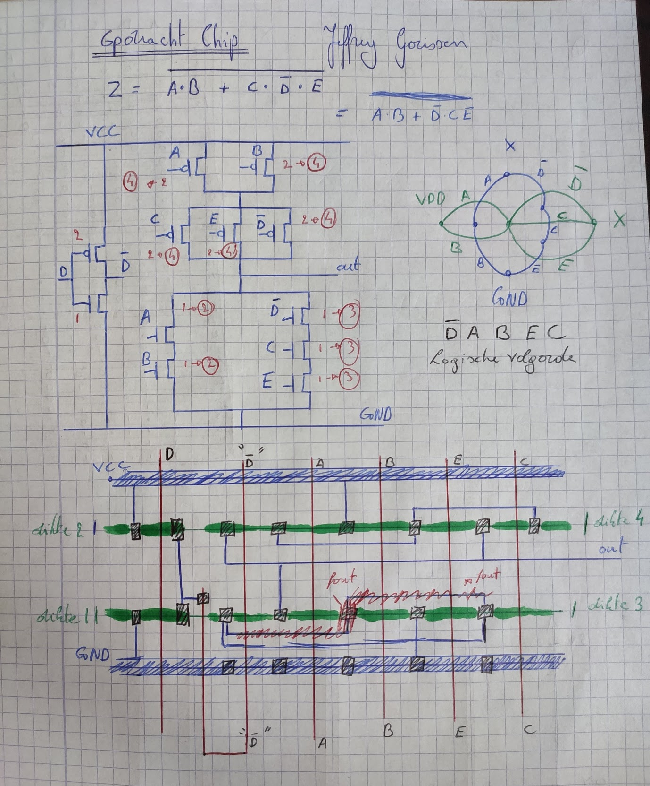
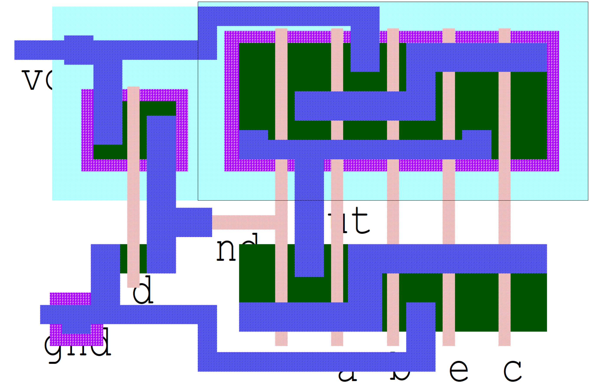
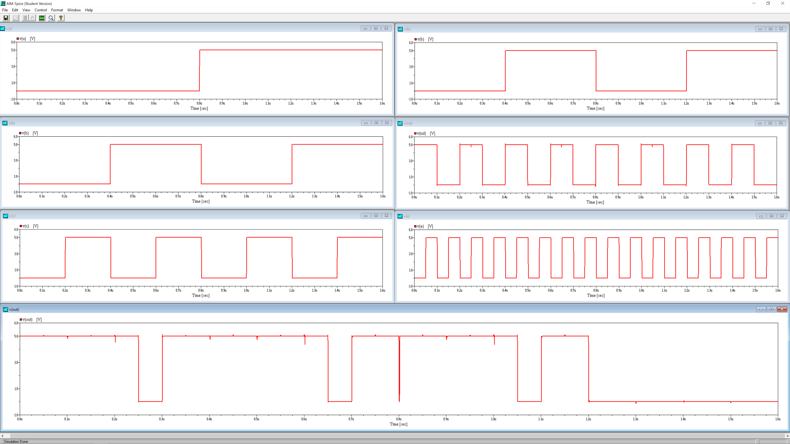
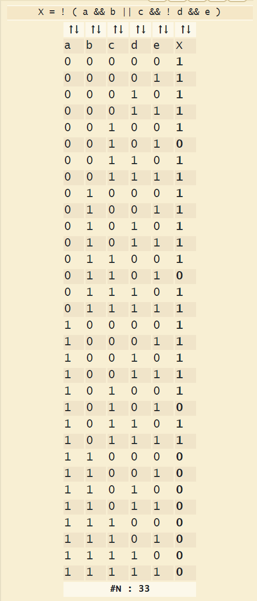

# Chip Design Assignment
Designing the lay-out of a CMOS-circuit with L-Edit and simulating the lay-out with AIM-Spice.

The given boolean expression that needs to be designed is;  Z = not[A.B+C.not(D).E]

## Design

The design process was started on paper. A picture of this process is included.
First the electrical schematic was drawn, after this the euler method was used to determine the logical order required to make a stick diagram. 

preliminary design on paper

## CMOS drawing
The design of the CMOS-circuit in L-Edit.

Design in L-Edit

## Simulation

This simulation was made using AIM-Spice. The design seems to function as it should.

Result of the simulation

In oder to verify that the resulting simulation, hence the design, is correct a truth table needs to be checked. 
As seen in the truth table below, the simulation corresponds with the table. (Do not mind the glitch)

Truth Table

## Authors

* *Jeffrey Gorissen*        - Student   - [GitHub](https://github.com/J3G0)

## License

This project is licensed under the MIT License - see the [LICENSE](LICENSE) file for details.
